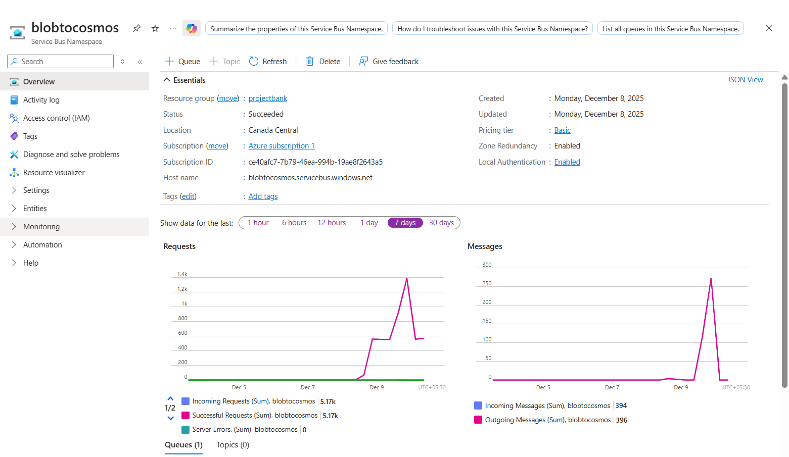
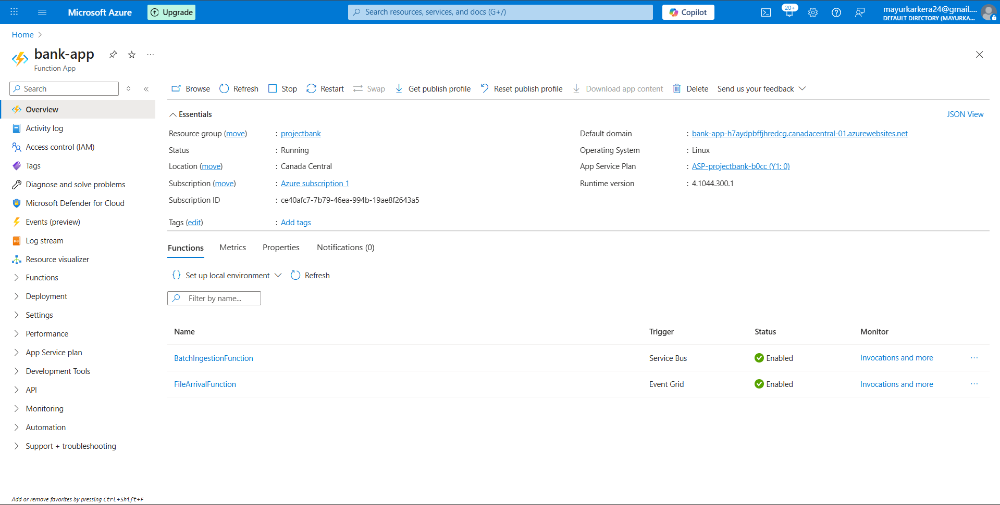
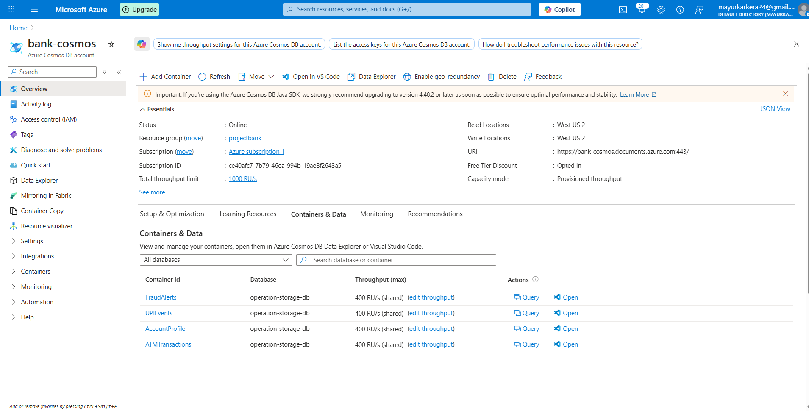
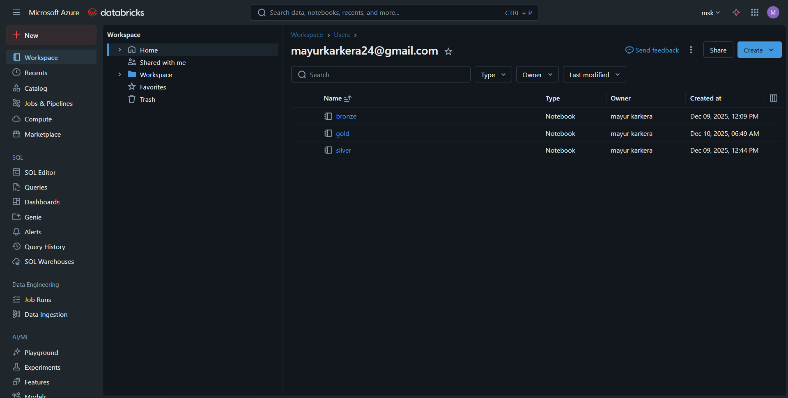
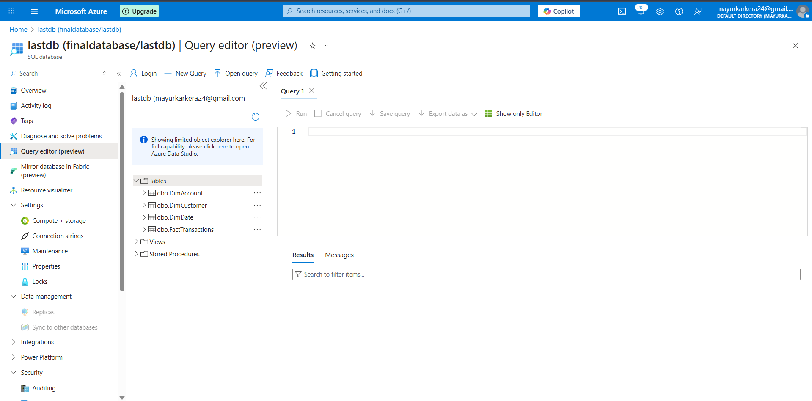
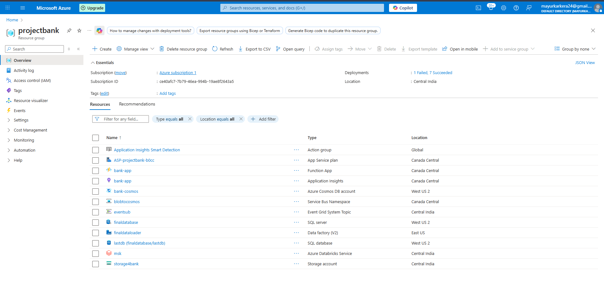

# Azure Banking Data Platform – End-to-End Project

## Overview

This repository contains a complete **modern Banking Data Platform** built on Azure. The platform covers real-time data ingestion, curated analytics layers, dimensional data modeling, and visualization through Power BI. It has been designed as a learning-focused, beginner-friendly end-to-end implementation using Azure’s core data engineering services.

The solution demonstrates:

* Real-time ingestion of ATM and UPI events
* ETL/ELT pipelines using Databricks
* Delta Lake architecture (Bronze → Silver → Gold)
* Dimensional modeling for analytics
* Power BI dashboards
* Simple CI/CD using GitHub Actions for Azure Functions and Databricks notebooks

---

## Architecture Summary

## End-to-End Process Logic (How the Entire System Works)

This section explains in detail how every Azure component works together in sequence to create a complete, real-time banking data platform.

### 1. Event Creation (ATM, UPI, Mobile Banking Systems)

Real-world banking systems generate events for:

* ATM cash withdrawals and balance checks
* UPI payments (debit and credit)
* Login/device activity from mobile banking apps

These events are continuously produced by upstream channels and emitted as files or messages.


### 2. Event Grid – Event Detection & Routing

Event Grid listens for new events such as:

* A new file lands in ADLS raw container
* A message or webhook from upstream systems

Logic performed:

* Detects the new event instantly
* Routes it to Azure Functions with event metadata
* Guarantees low-latency triggering

### 3. Azure Functions – Real-Time Ingestion & Validation

Azure Functions serve as the ingestion processor. Responsibilities:

* Receive event payload from Event Grid
* Parse metadata (file path, timestamp, event type)
* Validate schema (required fields)
* Normalize event shape (timestamps, numeric fields)
* Classify event type: ATM / UPI / Login
* Push the cleaned record into **Cosmos DB** collections

Functions ensure **high throughput** and **light transformations** before storage.

### 4. Cosmos DB – Operational Data Store

Cosmos DB stores data for fast reads and real-time usage.

Collections include:

* ATMTransactions
* UPIEvents
* AccountProfile
* FraudAlerts

Logic:

* ACID operations for real-time inserts
* Partitioning by customer or transaction ensures high scalability
* Can be queried by dashboards and fraud systems directly


### 5. Databricks Bronze Layer – Raw History Store

Bronze tables contain the rawest usable version of the data.

Logic:

* Load from Cosmos DB using Spark connectors
* Preserve raw schema and values
* Add ingestion date/time fields
* Write to Delta Lake for ACID + time travel

Purpose:

* Permanent storage
* Auditability
* Source of truth for downstream layers

### 6. Databricks Silver Layer – Cleansed & Standardized Data

Silver applies the heavy transformation logic:

* Remove duplicates
* Enforce standardized schema across ATM + UPI
* Clean nulls, correct data types
* Generate derived columns like `Year`, `Month`, `DateKey`
* Join with reference data when required

Silver outputs consistent, analytics-ready tables.

### 7. Databricks Gold Layer – Dimensional Model Creation

Gold is the business modeling layer.

#### Dimension logic:

* **DimCustomer**: Merge raw customer data, calculate KYC status, compute risk score, maintain historical changes (SCD2)
* **DimAccount**: Account profile, type, status, balance, IFSC, branch
* **DimDate**: Calendar table with fiscal periods and DateKey

#### Fact logic:

* **FactTransactions**: Combine Silver data with surrogate keys, calculate metrics, standardize transaction attributes

Gold forms a **star schema** used by SQL and Power BI.


### 8. Loading to SQL (Optional Analytics Warehouse)

Gold Delta tables can be loaded into Azure SQL using:

* ADF Copy Activity
* Databricks SQL Connector

This enables enterprise reporting and regulatory dashboards.


### 9. Power BI – Business Analytics Layer

Power BI reads from SQL or Gold Delta.

Logic applied:

* DAX measures (Spend, Income, RiskScore)
* Channel KPIs (ATM vs UPI performance)
* Trend reporting by DateKey
* Customer 360 views
* Fraud alert patterns

### 10. CI/CD Pipeline Logic

A simple GitHub Actions pipeline automates deployments:

* Deploys updated Azure Functions using ZIP deploy
* Uploads Databricks notebooks to workspace paths
* Ensures ingestion and ETL pipelines remain up to date

This beginner-friendly pipeline avoids complex IaC and allows fast iteration.

---

## Architecture Summary

**Event Sources → Azure Functions → Cosmos DB → Databricks Pipelines → Gold Layer → SQL/Power BI**

### Data Flow

1. ATM/UPI events are triggered into Azure through **Event Grid**.
2. **Azure Functions** process the incoming events.
3. Cleaned data is written into **Cosmos DB**.
4. Databricks loads Cosmos DB and raw files into **Bronze**.
5. Clean transformations produce the **Silver** layer.
6. Gold layer creates:

   * DimCustomer
   * DimAccount
   * DimDate
   * FactTransactions
7. Power BI connects to the analytics-ready schema.

---

## Components

### 1. Real-Time Ingestion

* **Event Grid** triggers when files or events arrive.
* **Azure Functions (Python)** handle validation, schema correction, and routing.
* **Cosmos DB** stores operational data for low-latency lookups.

### 2. Databricks ETL

#### Bronze Layer

* Stores raw data
* Normalizes schema

#### Silver Layer

* Deduplicates
* Enforces correct datatypes
* Standardizes timestamps and joins

#### Gold Layer (Dimensional Model)

* FactTransactions with keys for customer, account, and date
* DimCustomer, DimAccount, DimDate tables created as Delta
* Designed for BI tools and optimized reporting

---

## Data Modeling

The Gold layer follows a classic **star schema**.

### Fact Table

* FactTransactions

### Dimension Tables

* DimCustomer
* DimAccount
* DimDate

Each dimension includes surrogate keys for optimized joins and historical tracking.

---

## Power BI Reporting

Dashboards include:

* Customer 360 overview
* Fraud indicators and alerts
* Channel performance across ATM/UPI
* Daily and monthly transaction trends

---

## CI/CD Pipeline (Beginner-Friendly)

This project includes a minimal GitHub Actions workflow.

### What the pipeline automates:

1. Deploys Azure Functions through ZIP deployment
2. Uploads all notebooks in `/databricks/notebooks/` into Databricks Workspace

### Required GitHub Secrets

* `AZURE_CREDENTIALS` – Service principal credentials
* `DATABRICKS_HOST` – Workspace URL
* `DATABRICKS_TOKEN` – PAT token

The workflow triggers automatically on every push to `main`.

---

## Repository Structure

```
project-root/
│
├── functions/             # Azure Functions (Python)
├── databricks/
│   └── notebooks/         # Bronze, Silver, Gold notebooks
├── powerbi/               # Dashboard files
├── adls/                  # Storage layers (raw/bronze/silver/gold)
└── .github/workflows/     # CI/CD pipelines
```

---

## Running the Project

### Step 1: Deploy Azure Resources

Manually create:

* Storage account
* Cosmos DB account
* Function App
* Databricks workspace
* Event Grid subscription

### Step 2: Push Code to Main

GitHub Actions deploys:

* Azure Functions
* Databricks notebooks

### Step 3: Run ETL in Databricks

Execute in order:

1. Bronze ingestion
2. Silver transformation
3. Gold modeling (dimensions + fact)

### Step 4: Load Gold to SQL (optional)

Can be done using ADF, Databricks, or Power BI Direct Lake.

### Step 5: Build Dashboards

Connect Power BI to SQL or Delta tables and build analytical reports.

---

## Technologies Used

* Azure Functions
* Event Grid
* Cosmos DB
* ADLS Gen2
* Databricks / PySpark / Delta Lake
* Azure SQL (optional)
* Power BI


---

